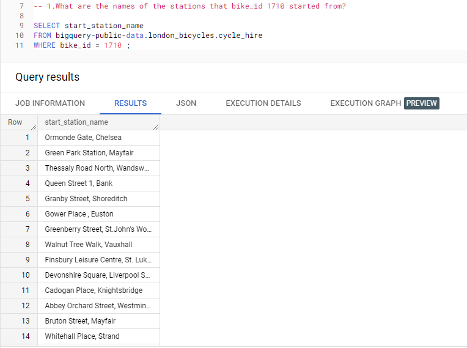
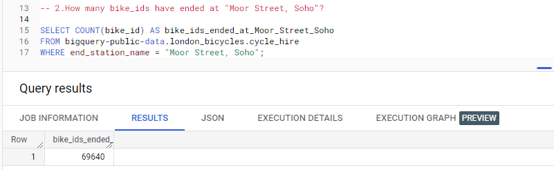
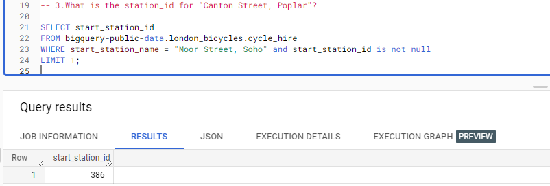
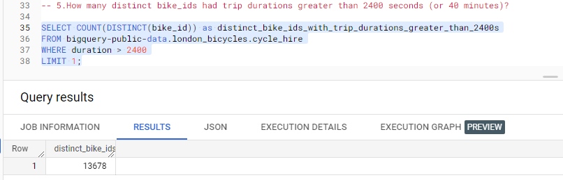
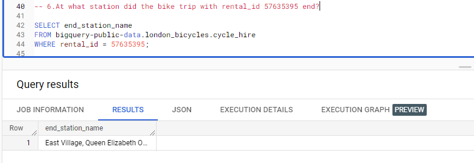
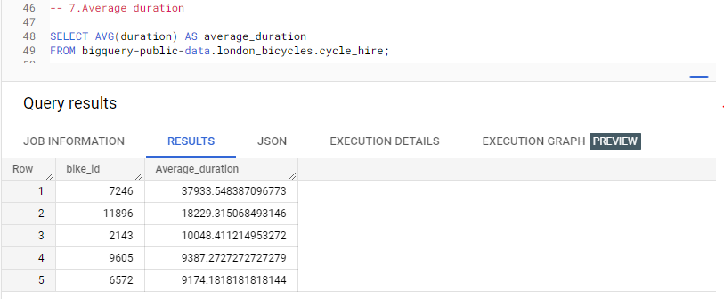
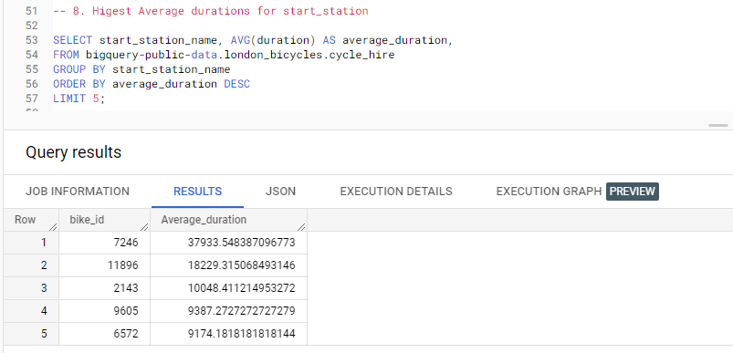
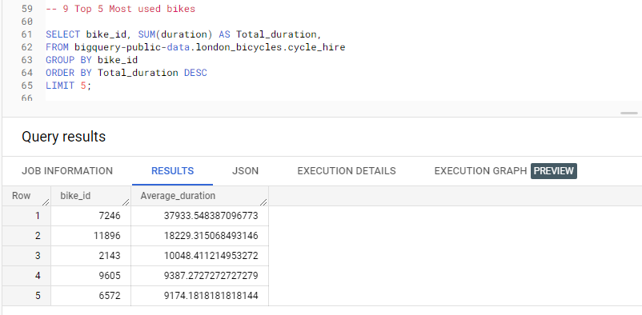
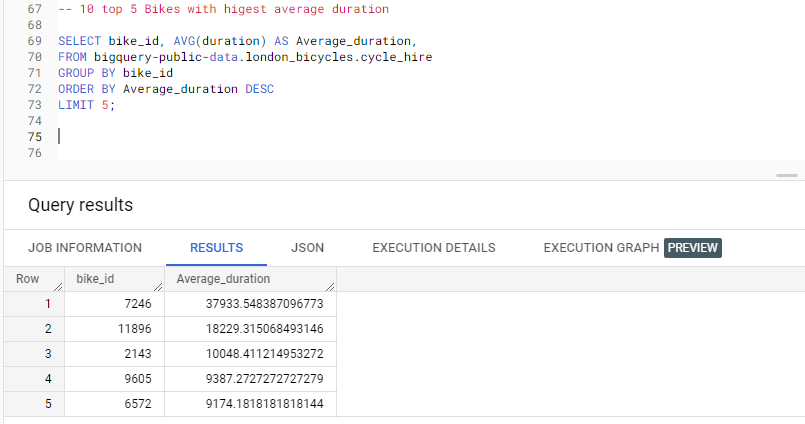

# Riding-the-Data-Pedel :
# Uncovering Trends in London's Bike Share Program with BigQuery

## Introduction

The "Riding-the-Data-Pedel-Uncovering-Trends-in-London-s-Bike-Share-Program-with-BigQuery" repository on GitHub is a project by ABHIJITHCV11 aimed at analyzing the bike share program in London using Google's BigQuery platform. The repository includes code and the analysis of bike share usage patterns and trends in London.

The project uses BigQuery to query and analyze a large dataset of bike share trips, including data on trip duration, start and end locations, and user demographics. The analysis includes the use of SQL queries to aggregate and summarize the data.

The repository contains detailed documentation with explanations of the analysis methods and results. The code is well-organized and easy to follow, making it a great resource for anyone interested in exploring data analysis with BigQuery and bike share data.

## BigQuery

For this activity, we need a BigQuery account.
BigQuery is a data warehouse on Google Cloud that data analysts can use to query, filter large datasets, aggregate results, and perform complex operations. 

The [code](https://console.cloud.google.com/bigquery?sq=899801418164:40a4efd3ab644bcfa641979451262551) can be found here.
## Setting up BigQuery

1. Log in to BigQuery. 
2. Then, click the Go to console button on the BigQuery homepage. This will open a new tab with your console.
3. On the left side,there is an Explorer menu; this includes a search bar that can used to find resources, pinned projects, and the + ADD DATA button. On the right side,  there is Query Editor. This is where you will input queries and view datasets. You can also find your Job History, Query History, and Saved Queries here. 
 
## Loading Data
To begin writing queries, we'll require some data to work with. We can access a public dataset directly from our console, which makes it possible for us to start working with the data right away.

1. Click on the + ADD DATA button in the Explorer menu and select Explore public datasets. This will open a new menu where you can search public datasets that are already available through Google Cloud. 
2. In the dataset menu you just opened, type london bicycle in the search box at the top; this will return the London Bicycle Hires dataset from the Greater London Authority. Click the dataset for more details.
3. From the dataset information page, click the blue VIEW DATASET button. This will open your console in a new tab with this dataset loaded. 
4. Click on the arrow next to bigquery-public-data and scroll down the list of public datasets to find the london_bicycles data. When we click on the dataset, it will list two tables. Click on cycle_hire.
5. After checking out the table schema, we can take a peek into what data the cycle_hire table contains by clicking on the Preview tab. This will give you a better idea of what kind of data you’ll be working with.

## Riding-the-Data-Pedel "SQL Querying"
### Questions

1. What are the names of the stations that bike_id 1710 started from?

2. How many bike_ids have ended at "Moor Street, Soho"?

3. What is the station_id for "Canton Street, Poplar"?

4. What is the name of the station whose ID is 111?

5. How many distinct bike_ids had trip durations greater than 2400 seconds (or 40 minutes)?

6. At what station did the bike trip with rental_id 57635395 end?

7. Average duration 

8. What are the start stations with the highest average durations?

9. What are the top 5 Most used bikes

10. Which are the top 5 bikes with the highest average duration?

### Answers

The [code](https://console.cloud.google.com/bigquery?sq=899801418164:40a4efd3ab644bcfa641979451262551) can be found here.

<kbd>    </kbd>
---------------------------------

<kbd>    </kbd>
---------------------------------

<kbd>    </kbd>
---------------------------------

<kbd>    </kbd>
---------------------------------

<kbd>    </kbd>
---------------------------------

<kbd>    </kbd>
---------------------------------

<kbd>    </kbd>
---------------------------------

<kbd>    </kbd>
---------------------------------

<kbd>    </kbd>
---------------------------------

<kbd>    </kbd>
---------------------------------

## Top Takeaways from Analyzing London's Bike Share Program with BigQuery

* A total of 13,678 distinct bike IDs had trip durations greater than 2400 seconds or 40 minutes.
* The average bike rental duration in the program is 1332.29 seconds, which is equivalent to approximately 22 minutes.
* Stewart's Road, Nine Elms had the highest average duration for start stations, with an average duration of 4836.38 seconds, or about 1 hour and 20 minutes.
* The top 5 most used bikes in the program were bikes with IDs 3317, 9354, 2143, 9721, and 162, in descending order.
* The top 5 bikes with the highest average duration were bikes with IDs 7246, 11896, 2143, 9605, and 6572, in descending order, with average durations ranging from about 2 hours to 10 hours.
* Overall, the data suggests that some bikes are being used for much longer durations than others, indicating potential discrepancies in bike maintenance and replacement. Additionally, there are certain start stations where rides tend to last much longer, indicating potential differences in the types of trips taken from these locations.
