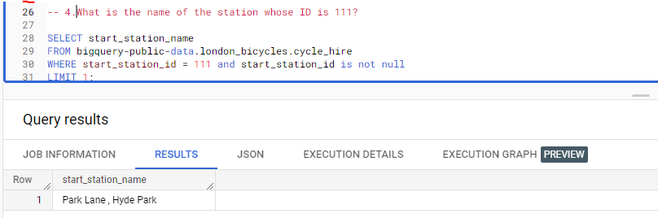

# Riding-the-Data-Pedel :
# Uncovering Trends in London's Bike Share Program with BigQuery

## BigQuery

For this activity, we need a BigQuery account.
BigQuery is a data warehouse on Google Cloud that data analysts can use to query, filter large datasets, aggregate results, and perform complex operations. 

## Setting up BigQuery

1. Log in to BigQuery. 
2. Then, click the Go to console button on the BigQuery homepage. This will open a new tab with your console.
3. On the left side,there is an Explorer menu; this includes a search bar that can used to find resources, pinned projects, and the + ADD DATA button. On the right side,  there is Query Editor. This is where you will input queries and view datasets. You can also find your Job History, Query History, and Saved Queries here. 
 
## Loading Data
To begin writing queries, we'll require some data to work with. We can access a public dataset directly from our console, which makes it possible for us to start working with the data right away.

1. Click on the + ADD DATA button in the Explorer menu and select Explore public datasets. This will open a new menu where you can search public datasets that are already available through Google Cloud. 
2. In the dataset menu you just opened, type london bicycle in the search box at the top; this will return the London Bicycle Hires dataset from the Greater London Authority. Click the dataset for more details.
3. From the dataset information page, click the blue VIEW DATASET button. This will open your console in a new tab with this dataset loaded. 
4. Click on the arrow next to bigquery-public-data and scroll down the list of public datasets to find the london_bicycles data. When we click on the dataset, it will list two tables. Click on cycle_hire.
5. After checking out the table schema, we can take a peek into what data the cycle_hire table contains by clicking on the Preview tab. This will give you a better idea of what kind of data you’ll be working with.

## Riding-the-Data-Pedel "SQL Querying"
### Questions
1.What are the names of the stations that bike_id 1710 started from?

2.How many bike_ids have ended at "Moor Street, Soho"?

3.What is the station_id for "Canton Street, Poplar"?

4.What is the name of the station whose ID is 111?

5.How many distinct bike_ids had trip durations greater than 2400 seconds (or 40 minutes)?

6.At what station did the bike trip with rental_id 57635395 end?

### Asnwers

<kbd>    </kbd>
---------------------------------

<kbd>    </kbd>
---------------------------------

<kbd>    </kbd>
---------------------------------

<kbd>    </kbd>
---------------------------------

<kbd>    </kbd>
---------------------------------

<kbd>    </kbd>
---------------------------------
